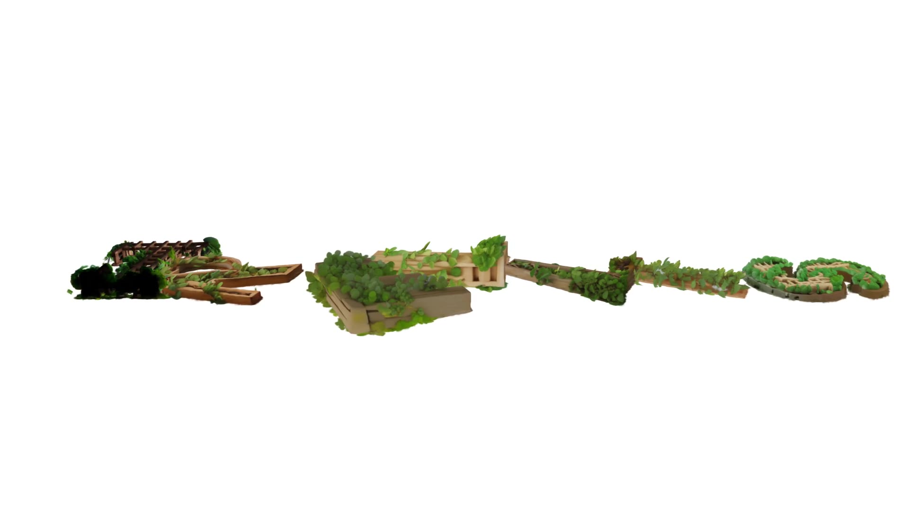

<h1 align="center">Editable Generative 3D Gaussians</h1>

<p align="center">
<a href="https://minn-k.github.io/3d-representation-portfolio/"></a>
<a href="https://github.com/minn-k/apg-gs-chainmail"></a>
<a href="https://github.com/minn-k/3dgs-isaac-sim-xpbd"></a>
</p>

<p align="center"></p>

Generated 3D Gaussians look finished but have no structure: every Gaussian is an independent primitive, so nothing
moves together when you edit. This repository connects public generative models (SDXL-Turbo, TRELLIS) to the
**APG-GS** editing representation. Generated Gaussians are reduced to an editing-friendly count, connected by a
Bhattacharyya-overlap Gaussian graph, and deformed by a CUDA XPBD solver that also updates each Gaussian's covariance
(Σ′ = FΣ₀Fᵀ). Semantic parts are read out of TRELLIS' own generation process, so every Gaussian carries a `part_id`
that the graph and the physics can use.

## Features

- **Prompt → editable asset.** Text → SDXL-Turbo image → TRELLIS 3D Gaussians → structure graph → interactive
  deformation, on one 12 GB GPU.
- **Fewer Gaussians, same look.** Importance selection + render-guided re-fit: 794,944 → 99,999 Gaussians at
  49.0 dB object PSNR against the original render; one XPBD step 97 → 18 ms.
- **Parts from generation internals.** TRELLIS cross-attention and DiT features, an input camera estimated from
  attention and silhouette, and visibility-aware projection of 2D part names give every Gaussian a `part_id` and a
  confidence, including sides the input image never showed.
- **Part-aware structure and physics.** Cross-part graph edges reduced to joints, per-part materials (rigid body +
  soft arms), part-level posing, and `part_id` export for other tools and viewers.
- **TRELLIS on Windows.** An xformers shim on PyTorch SDPA and Gaussian-only patches; no kaolin, nvdiffrast, xformers
  or flash-attn builds needed.

## Pipeline

```text
 text ──SDXL-Turbo──▶ image ──TRELLIS──▶ 3D Gaussians (0.5–0.8 M, 32 per voxel)
                        │          │            │
                        │          │            ├─ distill.py      importance selection + re-fit → 100k / 50k
                        │          │            ├─ to_model.py     3DGS model folder (SH 3, opacity prune)
                        │          │            └─ prepare_gen.py  APG graph: Bhattacharyya overlap + k-NN (SIBR, headless)
                        │          │
                        │          └─ gen3d_sem.py: SLat transformer cross-attention + DiT features, recorded while sampling
                        │                          │
                        └─ seg2d.py: named 2D parts ──▶ lift_parts.py ──▶ part_id per Gaussian
                                                                              │
                  part_graph.py · export_parts.py ◀───────────────────────────┤
                                                                              ▼
            edit_demo.py · semantic_pose.py · semantic_shake.py · letters_drop.py   (CUDA XPBD + Σ′ = FΣ₀Fᵀ)
```

## Repository structure

```text
demos/generative-3d/
  gen2d.py                     text → image (SDXL-Turbo, 2 steps)
  gen3d.py · gen3d_sem.py      image → 3D Gaussians (TRELLIS); gen3d_sem also records attention + DiT features
  distill.py · prune_test.py   count reduction (re-fit) and the prune-only baseline
  to_model.py · prepare_gen.py · graph_stats.py
                               TRELLIS PLY → 3DGS model folder → APG graph → graph statistics
  edit_demo.py                 grab-and-pull editing; position-only vs Σ′ = FΣ₀Fᵀ renders
  seg2d.py · dl_seg.py         named 2D parts on the input image (Grounding DINO + SAM)
  parts_core.py                2D parts → 3D part labels (NumPy/SciPy only; the method lives here)
  lift_parts.py · parts_video.py · sem_viz.py
                               run parts_core on an asset; part turntable; signal visualisation
  part_graph.py                part-aware graph: joints between parts, per-part stiffness
  export_parts.py              part_id → PLY property, raw bytes, JSON, SIBR model folders
  semantic_pose.py · semantic_shake.py · semantic_drop.py
                               part-level posing and per-part materials
  gen_letters.py · letters_drop.py · run_*.sh
                               the T-R-E-L-L-I-S opener and batch runs
  gs_utils.py                  shared math, TRELLIS PLY loading, fonts, runtime path
  patches/ · shims/            TRELLIS patches (pinned commit) and the xformers → SDPA shim
  results/                     measured logs behind every number on the portfolio page
  tests/                       synthetic test of the part lifting (no GPU)
site/                          GitHub Pages source: index.html, assets/, make_web.py, update_media.py
```

## Installation

### Prerequisites

- **System:** tested on Windows 11. Generation, re-fit, part labeling and export are plain Python; the physics demos
  need the APG runtime (below), whose solver is a Windows DLL.
- **Hardware:** NVIDIA GPU with at least 12 GB (tested on an RTX 4070 SUPER 12 GB). TRELLIS sampling peaks at
  5.9 GB; SDXL-Turbo runs with CPU offload.
- **Software:** CUDA Toolkit 11.8, conda with Python 3.10, Git, and Visual Studio C++ Build Tools (to compile the
  rasterizer on Windows).

### Steps

1. **Clone and create the environment.**

   ```sh
   git clone https://github.com/minn-k/3d-representation-portfolio.git
   cd 3d-representation-portfolio/demos/generative-3d
   conda create -n trellis python=3.10 -y
   conda activate trellis
   pip install torch==2.5.1 torchvision==0.20.1 --index-url https://download.pytorch.org/whl/cu118
   pip install -r requirements.txt
   ```

2. **TRELLIS at the pinned commit, with the patches.** The scripts expect it at `demos/generative-3d/TRELLIS`.

   ```sh
   git clone --recurse-submodules https://github.com/microsoft/TRELLIS.git
   cd TRELLIS
   git checkout 442aa1e1afb9014e80681d3bf604e8d728a86ee7
   git submodule update --init --recursive
   git apply --exclude=trellis/representations/mesh/flexicubes ../patches/trellis_windows_gaussian_only.patch
   git -C trellis/representations/mesh/flexicubes apply ../../../../../patches/flexicubes_optional_kaolin.patch
   cd ..
   ```

   `gen3d.py` / `gen3d_sem.py` put `shims/` and `TRELLIS/` on `sys.path` and set `ATTN_BACKEND=xformers` and
   `SPCONV_ALGO=native`. The shim implements the two xformers calls TRELLIS uses with PyTorch SDPA, so no xformers or
   flash-attn wheel is needed.

3. **3DGS rasterizer** (renders, re-fit, editing videos). The scripts use the `antialiasing` field of the graphdeco
   rasterizer, which is on its `dr_aa` branch (the commit pinned by graphdeco's gaussian-splatting):

   ```sh
   pip install --no-build-isolation "git+https://github.com/graphdeco-inria/diff-gaussian-rasterization.git@9c5c2028f6fbee2be239bc4c9421ff894fe4fbe0"
   ```

4. **Model weights** download from Hugging Face on first use: `stabilityai/sdxl-turbo`,
   `microsoft/TRELLIS-image-large` (plus DINOv2 through `torch.hub`). For the part segmentation models run
   `python dl_seg.py` once (`IDEA-Research/grounding-dino-tiny`, `facebook/sam-vit-base`).

5. **APG runtime** (graph construction and physics only). Set two environment variables:

   ```sh
   set APG_ROOT=C:\gaussian-splatting                # holds output_1/ (3DGS model folders)
   set APG_RUNTIME_ROOT=C:\gaussian-splatting\apg_runtime
   ```

   The scripts import the following from `APG_RUNTIME_ROOT`:

   | File | Provides | Used by |
   |---|---|---|
   | `prepare_splat.py` | `read_ply`, crop, `<name>_transform.json` | `prepare_gen.py`, editing demos |
   | `prepare_dataset.py` | crop box, graph weights, SIBR path | `prepare_gen.py` |
   | `import_graph.py` | viewer graph → `<name>_graph.npz` in PLY order | `prepare_gen.py` |
   | `xpbd.py` + `xpbd_dll/*.dll` | CUDA XPBD solver (`XPBD`, `load_inputs`, `world_ground`) | editing demos, `part_graph.py` CLI |
   | SIBR Gaussian viewer (APG build) | Bhattacharyya graph export, run headless through `APG_AUTORUN` | `prepare_gen.py` |

   The public [3dgs-isaac-sim-xpbd](https://github.com/minn-k/3dgs-isaac-sim-xpbd) repository has the CUDA solver
   source, its ctypes bridge, `prepare_splat.py` and `import_graph.py`, and
   [apg-gs-chainmail](https://github.com/minn-k/apg-gs-chainmail) has the earlier viewer overlay. The newer calls used
   here (`world_ground`, per-particle weights, headless graph export, `prepare_dataset.py`) are not published yet.
   Until they are, the physics scripts run only with the author's runtime. Everything before the graph (generation,
   re-fit, part labels, export) runs without it.

6. **Check the install** without a GPU:

   ```sh
   python -m pytest tests
   ```

## Usage

All commands run from `demos/generative-3d/` in the `trellis` environment. Outputs go to `out/<name>/` (not tracked),
model folders to `%APG_ROOT%/output_1/gen_<name>/`, and runtime assets to `%APG_RUNTIME_ROOT%/gen_<name>/`.

### Minimal example: prompt → editable asset

```sh
python gen2d.py --name bear --prompt "a cute plush teddy bear toy sitting" --seeds 0-3     # pick one image
python gen3d.py --image out/bear/text2img_s3.png --name bear                                # gaussian.ply + turntable.mp4
python distill.py --name bear --keep 100000                                                 # distill_100k.ply
python to_model.py --name bear_d100k --ply out/bear/distill_100k.ply
python prepare_gen.py bear_d100k                                                            # APG graph (SIBR, headless)
python graph_stats.py bear_d100k
python edit_demo.py --name gen_bear_d100k --grab-dir 1,0,1.3 --pull 1,-0.2,0.4 --dist 0.06 --pin-h 0.5
```

`edit_demo.py` writes `edit_compare.mp4` (left: positions only, right: positions + Σ′ = FΣ₀Fᵀ) and `edit_stats.json`.
`run_asset.sh` and `run_variants.sh` run these steps for several assets.

### Semantic parts: every Gaussian gets a `part_id`

```sh
python gen3d_sem.py --image out/bear/text2img_s3.png --name bear_sem           # + sem.npz (attention, DiT features)
python seg2d.py --name bear_sem --parts "head,arm=left arm|right arm|teddy bear arm,body=torso|belly,leg=foot|teddy bear foot,bow tie"
python distill.py --name bear_sem --keep 100000
python to_model.py --name bear_sem_d100k --ply out/bear_sem/distill_100k.ply
python prepare_gen.py bear_sem_d100k
python lift_parts.py --name bear_sem --asset gen_bear_sem_d100k                # parts3d.npz, camera_fit.png, parts3d_grid.png
python parts_video.py --name bear_sem                                          # colour | part_id turntable
```

- Check `camera_fit.png` first. It draws the visible voxels, coloured by their 3D part, over the input image with the
  estimated camera. The silhouette IoU and colour correlation are in `parts3d_stats.json`. If the camera is not
  trusted, `lift_parts.py` falls back to attention-only labels; `--mode attn` always reproduces the earlier method.
- Part names are chosen per object (`name=phrase1|phrase2`). Overlapping masks go to the smaller, more specific part.

### Using `part_id` downstream

```sh
python export_parts.py --asset gen_bear_sem_d100k --parts out/bear_sem/parts3d.npz --sibr --hide arm
python part_graph.py  --asset gen_bear_sem_d100k --parts out/bear_sem/parts3d.npz --cross-keep 0.1 --joint overlap
python edit_demo.py   --name gen_bear_sem_d100k --parts out/bear_sem/parts3d.npz --cross-keep 0.1 --grab-part arm ...
python semantic_pose.py  --asset gen_robot_sem_d100k --parts out/robot_sem/parts3d.npz    # lift "the right arm" at the shoulder
python semantic_shake.py --asset gen_robot_sem_d100k --parts out/robot_sem/parts3d.npz    # soft arms, stiffer body
```

- `export_parts.py` writes `<asset>_parts.ply` (all 3DGS properties + `part_id`, `part_conf`), `<asset>_part_id.u8`
  (one byte per Gaussian, crop-PLY order), and `<asset>_parts.json` (names, colours, counts, material table). With
  `--sibr` it also writes SIBR model folders: `<asset>_partcolor` (part colours) and `<asset>_hide-<parts>` (those parts
  made transparent). Open one with `SIBR_gaussianViewer_app -m %APG_ROOT%/output_1/<asset>_partcolor`. The viewer
  itself has no per-part toggles or per-part physics sliders yet; the exported files are what such a UI would load.
- `part_graph.py` writes `<asset>_graph_parts.npz` in the same CSR layout as `<asset>_graph.npz`. Cross-part edges keep
  either a random fraction (`--joint random`, used for the portfolio numbers) or, per part pair, the edges whose
  Gaussians overlap most (`--joint overlap`, smallest Bhattacharyya distance). `--materials` takes per-part stiffness.

### Letter opener (portfolio page)

```sh
python gen_letters.py --letters REL IS --seeds 0-3
bash run_letters.sh                                   # TRELLIS → 50k re-fit → APG graph for each letter
python letters_drop.py --preview                      # four stills to check layout and camera
python letters_drop.py                                # 1920×1080, 13 s → out/letters/letters_drop.mp4
python ../../site/update_media.py out/letters/letters_drop.mp4 letters_drop --poster-t 4
```

During the final camera pass the floor of each letter pulses up and snaps back (`--bounce-*`), so the letters pop
and wobble; `--no-bounce --shape 0.6 --damping 0.01` gives the earlier version.

### Portfolio site

`site/update_media.py <video> <asset-name>` re-encodes a video for the page (H.264, faststart) and writes its poster;
`site/make_web.py` regenerates the page from the measurement logs. The page is published from the `gh-pages` branch
(see [site/README.md](site/README.md)).

## How the part labels are made

TRELLIS generates in two flow stages conditioned on DINOv2 tokens of the input image (1 class + 4 register +
37 × 37 patch tokens). The first stage produces a 64³ occupancy (which voxels hold surface). The second stage, a
24-block sparse transformer, runs on those voxels grouped into 32³ tokens and produces an 8-dim latent per voxel.
A decoder then turns each voxel into 32 Gaussians, stored in voxel order. `gen3d_sem.py` hooks the second stage:

1. **Cross-attention** of every token to the image patches (blocks 4–23, conditional branch, steps 8–20).
2. **DiT features**, the 1024-dim block outputs (blocks 6, 12, 18, 23).

`lift_parts.py` (method in `parts_core.py`) then:

1. Votes 2D part fractions through the early-block attention.
2. Estimates the camera of the input image. Starting points are an affine fit from token centres to attention
   centroids and a global search over viewing directions. Each is refined against the object silhouette, and the one
   with the best silhouette overlap and colour agreement is kept (colour tells front from back).
3. Z-buffers the voxels, so that only voxels visible in the input image take the 2D part at their pixel. Part
   boundaries are eroded by a few pixels.
4. Propagates labels on a graph of touching tokens weighted by DiT-feature similarity, with confidently labeled
   visible tokens clamped.
5. Merges small fragments into their neighbours and sharpens visible voxels to 64³.
6. Labels hidden voxels by the part volume they bound. The shell is filled into a solid, and each hidden voxel
   follows the depth field inward to a part core. It takes the part whose visible seeds share that core and are
   reached through thick interior rather than thin necks.

Gaussian `i` takes the label of voxel `i // 32`; a re-fit asset takes its nearest voxel.

The earlier attention-only version mixed labels on the teddy bear's arm. Attention is feature retrieval, not a
correspondence, so uniform fur confuses it; every token on a viewing ray voted with the same pixels; and a
radius-4-token feature graph spread that noise across the arm–body–leg contacts. Propagating over the surface alone
then let the arm take the hidden sides and back of the body, which step 6 addresses. On a synthetic teddy bear with
known parts (`tests/test_parts_core.py`), visible-voxel accuracy goes from 0.85 to 0.98, hidden-voxel accuracy from
0.73 to 0.85, and the camera is recovered to 0.7 px.

## Results

Measured on one RTX 4070 SUPER 12 GB; every value is read from `demos/generative-3d/results/`.

| Asset | TRELLIS sampling | Peak VRAM | Generated Gaussians | 100k re-fit: object PSNR (prune only → re-fit) | XPBD step: full / 100k / 50k |
|---|---|---|---|---|---|
| Teddy bear | 25.1 s | 5.9 GB | 794,944 | 24.5 → 49.0 dB (13.4 s) | 97.0 / 18.2 / 9.6 ms |
| Potted plant | 20.6 s | 5.7 GB | 470,048 | 19.2 → 37.1 dB (12.2 s) | 51.2 / 19.1 / 9.8 ms |
| Guide robot | 19.3 s | 5.8 GB | 655,936 | 21.4 → 43.4 dB (13.1 s) | 49.2 / 17.0 / 9.3 ms |

The per-part materials in `semantic_shake.py` work as follows. The robot's feet are fixed to a base shaken ±4 cm at
2 Hz for 1.6 s. With the geometry graph (one material), head / torso / arms wobble 2.20 / 1.35 / 2.18 cm RMS. With
the part graph (rigid body, soft arms) they wobble 0 / 0 / 3.05 cm.

In `semantic_pose.py`, lifting the right arm 60° by name keeps its shape exactly (0 cm error, vs 0.52 cm when only the
hand is dragged).

## Limitations

- Single-image generation must invent unseen surfaces, so the back side is less reliable.
- Count reduction is post-processing; controlling the representation size at generation time is future work.
- Part prompts are chosen per object, thin parts (an antenna) can be missed, and the part lifting depends on the
  estimated input camera. Check `camera_fit.png`.
- Which parts are rigid or soft is chosen by hand; the solver's shape matching is one object-level rigid fit, so
  per-part rigid fitting inside the solver is the next step.
- The graph builder and the extended XPBD runtime are outside this repository (see Installation, step 5).

## Data policy

This repository does not track private scans, face data, trained models, generated splat assets, compiled binaries,
or large intermediate artifacts. Published media must be reproducible or cleared for public sharing.

## Acknowledgements

- [TRELLIS](https://github.com/microsoft/TRELLIS) (MIT License), patched in `patches/`.
- [SDXL-Turbo](https://huggingface.co/stabilityai/sdxl-turbo) by Stability AI, under its non-commercial research
  community license.
- [Grounding DINO](https://huggingface.co/IDEA-Research/grounding-dino-tiny), [SAM](https://huggingface.co/facebook/sam-vit-base)
  and [DINOv2](https://github.com/facebookresearch/dinov2) (Apache 2.0).
- The [3D Gaussian Splatting](https://github.com/graphdeco-inria/gaussian-splatting) rasterizer (Inria and MPII,
  research and evaluation license) and the [SIBR](https://gitlab.inria.fr/sibr/sibr_core) viewer (Inria, Apache 2.0).

This repository has no license file yet; third-party models and code keep their own licenses.

```bibtex
@article{xiang2024structured,
    title   = {Structured 3D Latents for Scalable and Versatile 3D Generation},
    author  = {Xiang, Jianfeng and Lv, Zelong and Xu, Sicheng and Deng, Yu and Wang, Ruicheng and Zhang, Bowen and Chen, Dong and Tong, Xin and Yang, Jiaolong},
    journal = {arXiv preprint arXiv:2412.01506},
    year    = {2024}
}
```
